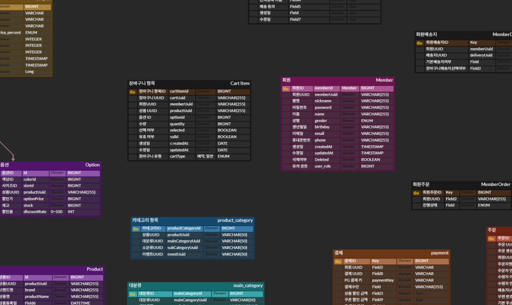
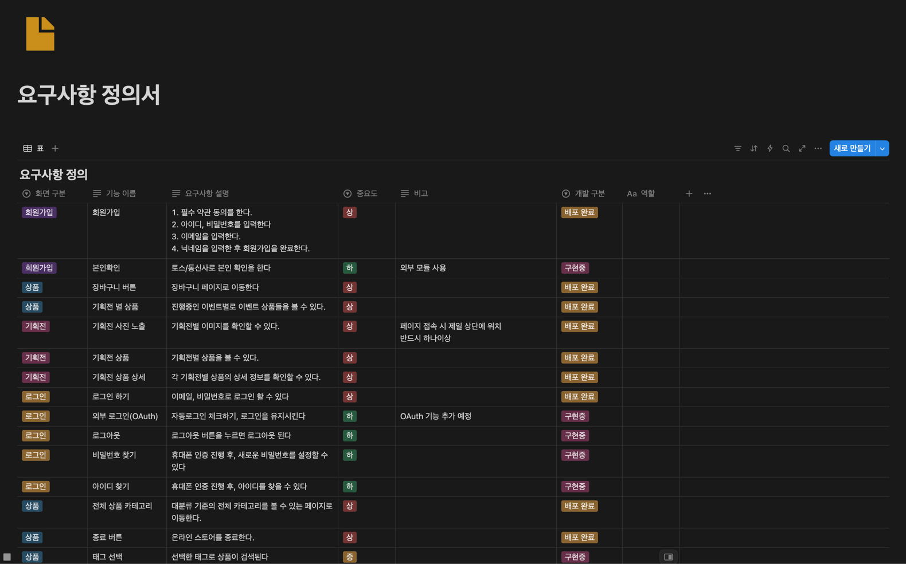
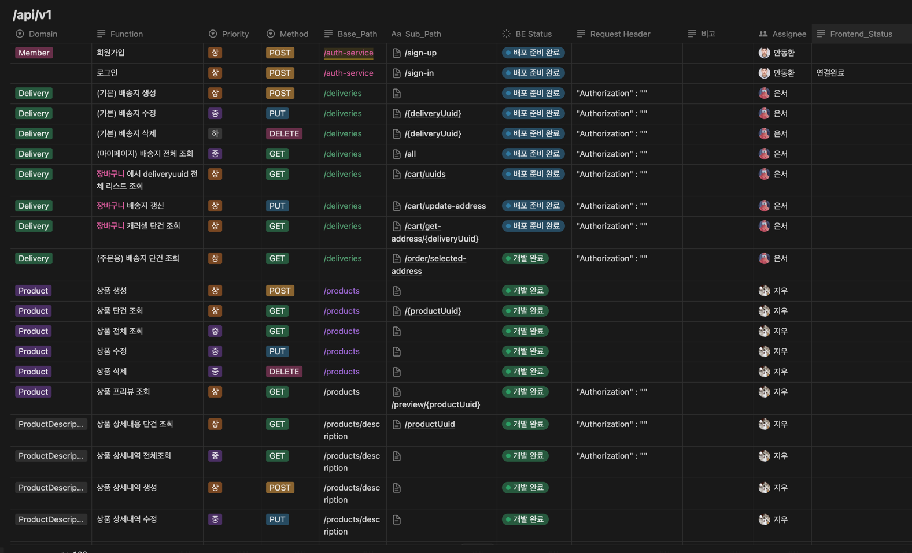

# Starbucks_renewal_project

<div align="center" style="font-size: 32px; font-weight: bold; color: #f4a261;">


</div>

## 📁 레포지토리 링크

|      구분       | 레포지토리                                                                 |
|:-------------:|:----------------------------------------------------------------------|
| Backend (BE)  | [BE-Starbucks-Renewal](https://github.com/3-114/BE-Starbucks-Renewal) |
| Frontend (FE) | [FE-Starbucks-Renewal](https://github.com/3-114/FE-Starbucks-Renewal) |

# 목차

1. [기획](#1-기획)
2. [팀원 소개](#2--팀원-소개)
3. [개발 환경](#3--개발-환경)
4. [주요 기능](#4--주요-기능)
5. [설계 문서](#5--설계-문서)
6. [프로젝트 규칙](#6--프로젝트-규칙)
7. [포팅 매뉴얼](#7--포팅-매뉴얼)

# 1. ✨ 기획

> #### ✨ 신세계 I&C [스파로스 6기](https://swedu.spharosacademy.com/spharos_total.html) - 리빌딩 프로젝트
>
> #### ⏫ 스타벅스 내 Shopping 서비스를 새롭게 구현 및 성능 개선
>
> #### 📅 개발 기간 : 2025년 3월 10일 ~ 4월 28일
>
> #### 🌐 홈페이지 : https://www.starbucks-renewal.shop/

---
<br>

# 2. 👥 팀원 소개

<div align="center">
<table>
  <tr>
    <td align="center"><a href="https://github.com/Demopeu">김동현</a></td>
    <td align="center"><a href="https://github.com/DoNalD-A">👑 송민석</a></td>
    <td align="center"><a href="https://github.com/Ahn-donghwan">안동환</a></td>
    <td align="center"><a href="https://github.com/EUNSEO-YA">오은서</a></td>
    <td align="center"><a href="https://github.com/chuman0216">추지우</a></td>
  </tr>

  <tr>
    <td align="center"><div class="role-box frontend">🖥️ Frontend</div></td>
    <td align="center"><div class="role-box backend">⚙️ Backend</div></td>
    <td align="center"><div class="role-box backend">⚙️ Backend</div></td>
    <td align="center"><div class="role-box backend">⚙️ Backend</div></td>
    <td align="center"><div class="role-box devops">☁️ DevOps</div></td>
  </tr>

  <tr>
    <td align="center">
      메인 페이지<br>
      상품 상세페이지<br>
      장바구니 페이지
    </td>
    <td align="center">
      상품 카테고리<br>
      이벤트(기획전)<br>
      QueryDSL
    </td>
    <td align="center">
      로그인/회원가입<br>
      JWT, Security<br>
      장바구니
    </td>
    <td align="center">
      회원 배송지<br>
      상품 상세 옵션<br>
      데이터 전처리/삽입
    </td>
    <td align="center">
      상품 기능<br>
      상품 이미지 관리<br>
      CI/CD
    </td>
  </tr>
</table>
</div>


---

# 3. 🛠 개발 환경

<br>

<div align="center">

### 🖥️ Front - End ↙️

<div align="center">
  
  
  
  <br>
  
  
  
  <br>
  
  
</div>

### ⚙️ Back - End ↙️

<div align="center">
  
  
  
  <br>
  
  
  
</div>

<br>

<div align="center">

### 🖥️ Collabo ↙️

</div>


<br>

<div align="center">

  <!-- 협업 도구 -->
  
  
  
  <br>

  <!-- 개발 도구 -->


</div>

<br>

---

# 4. 🌱 주요 기능

|                                           로그인                                           |                                           장바구니                                           |                                           기획전                                           |
|:---------------------------------------------------------------------------------------:|:----------------------------------------------------------------------------------------:|:---------------------------------------------------------------------------------------:|
|  |  |  |

|                                           메인                                           |                                           베스트                                           |                                           카테고리                                           |
|:--------------------------------------------------------------------------------------:|:---------------------------------------------------------------------------------------:|:----------------------------------------------------------------------------------------:|
|  |  |  |

---

# 5. 📜 설계 문서

### 🏗시스템 아키텍쳐


<br>

### 📝 [ERD 설계](https://www.erdcloud.com/d/AfbenbEeNpbLj2dwu)




<br>
<br>

### 📋 [요구사항 정의서](https://funky-baron-4b5.notion.site/1bc02141a4b3810fa400e69f078ac5ab?pvs=4)




<br>
<br>
</div>

### 📋 [API 명세서](https://funky-baron-4b5.notion.site/API-1b502141a4b3804485b7ef524f753b4a?pvs=4)



---

# 6. 🏁 프로젝트 규칙

## 1️⃣ 커밋 메시지 구조

커밋 메시지는 제목, 본문, 그리고 꼬리말로 구성됩니다.
[<스코프>]<타입>: <제목>

<본문>

<꼬리말>

#### _스코프(Scope)_

변경 사항의 범위를 나타냅니다. 예를 들어, 특정 모듈이나 기능의 이름을 사용할 수 있습니다.

- 예: auth, payment, ui, backend

#### _타입(Type)_

타입의 첫글자는 대문자로 작성합니다.

- _feat_: 새로운 기능 추가
- _fix_: 버그 수정
- _docs_: 문서 변경
- _style_: 코드 포맷팅, 세미콜론 누락 등 비즈니스 로직에 영향을 주지 않는 변경
- _remove_: 파일 삭제
- _refactor_: 코드 리팩토링, 기능 변경 없이 코드 개선
- _test_: 테스트 추가, 수정
- _chore_: 빌드 과정 또는 보조 도구 수정, 패키지 매니저 설정 등
- _perf_: 성능 향상 관련 변경
- _ci_: CI 구성 파일 및 스크립트 변경
- _wip_: 작업 진행 중 임시 저장

#### _제목(Subject)_

제목은 변경 사항을 간략하게 설명합니다. 첫 글자는 대문자로 작성하고, 명령문 형식으로 작성합니다.

- 50자를 넘지 않도록 하며, 마지막에 마침표를 찍지 않습니다.
- 예: [auth]feat: Add JWT authentication

#### _본문(Body)_

본문은 변경 사항의 이유와 주요 내용을 설명합니다. 필요 시 다음과 같은 규칙을 따릅니다:

- 한 줄에 72자를 넘지 않도록 합니다.
- "어떻게" 보다는 "무엇을", "왜" 변경했는지 설명합니다.
- 예:
    - Add JWT authentication to secure API endpoints
    - Update login method to issue JWT tokens
    - Modify user model to store JWT refresh tokens

---

## 2️⃣ Git 브랜치 작성 및 관리 규칙

#### _브랜치 생성 흐름_

1. GitHub Issue를 생성합니다. (이슈 내용에는 작업할 내용을 명확히 작성합니다.)
2. 이슈 페이지에서 **"Create branch"** 버튼을 눌러 브랜치를 생성합니다.
3. 생성된 브랜치에서 작업을 진행하고, 완료 후 Pull Request를 생성합니다.

#### _브랜치 타입_

브랜치 타입을 명확히 구분하여 브랜치 이름을 작성합니다:

- _feature_: 새로운 기능 개발
- _bugfix_: 버그 수정
- _hotfix_: 긴급 수정
- _release_: 릴리스 준비
- _refactor_: 코드 리팩토링
- _test_: 테스트 작성 및 수정
- _chore_: 빌드, 설정, 문서 등의 잡무
- _wip_: 작업 중간 저장 (Work in Progress)

#### _브랜치 네이밍 규칙_

브랜치 이름은 `<이슈번호>/<타입>/<설명>` 형식을 따릅니다.

- `feature` 브랜치: 새로운 기능 추가
    - 메인 기능 브랜치: `0/feature/login-main`
    - 하위 기능 브랜치: `0/feature/login/create`
- `bugfix` 브랜치: 버그 수정
    - 예시: `0/bugfix/fix-login-error`
- `hotfix` 브랜치: 긴급 수정
    - 예시: `0/hotfix/critical-bug-fix`
- `release` 브랜치: 릴리스 준비
    - 예시: `0/release/1.0.0`
- `refactor` 브랜치: 코드 리팩토링
    - 예시: `0/refactor/optimize-auth-module`
- `test` 브랜치: 테스트 작성
    - 예시: `0/test/add-unit-tests`
- `chore` 브랜치: 문서 수정, 라이브러리 업데이트 등
    - 예시: `0/chore/update-dependencies`

#### _브랜치 관리 전략_

- `main`: 항상 배포 가능한 상태를 유지합니다.
- `develop`: 다음 릴리스에 포함될 기능을 통합하는 브랜치입니다.
- 기능 개발은 이슈-브랜치 매칭을 원칙으로 합니다.

---

# 7. 💻 포팅 매뉴얼

이 프로젝트는 [Spring](https://spring.io/) 프레임워크 기반 프로젝트입니다.

## 시스템 요구사항

| Name            | Version                      |
|-----------------|------------------------------|
| OS              | Ubuntu : 22.04, Windows : 11 |
| Java            | 17                           |
| Spring Boot     | 3.4.4                        |
| Gradle - Groovy | 8.13                         |
| MySQL           | 9.2.0                        |

## 🔧의존성 및 라이브러리

```bash

	implementation 'org.springframework.boot:spring-boot-starter-data-jpa'
	implementation 'org.springframework.boot:spring-boot-starter-web'
	compileOnly 'org.projectlombok:lombok'
	developmentOnly 'org.springframework.boot:spring-boot-devtools'
	runtimeOnly 'com.mysql:mysql-connector-j'
	annotationProcessor 'org.projectlombok:lombok'
	testImplementation 'org.springframework.boot:spring-boot-starter-test'
	testRuntimeOnly 'org.junit.platform:junit-platform-launcher'

	// Spring Security
	implementation 'org.springframework.boot:spring-boot-starter-security'

	// Jwt
	implementation group: 'io.jsonwebtoken', name: 'jjwt-api', version: '0.12.5'
	implementation group: 'io.jsonwebtoken', name: 'jjwt-impl', version: '0.12.5'
	implementation group: 'io.jsonwebtoken', name: 'jjwt-jackson', version: '0.12.5'

	// swagger
	implementation 'org.springdoc:springdoc-openapi-starter-webmvc-ui:2.7.0'

	// Validation
	implementation 'org.springframework.boot:spring-boot-starter-validation'


```

## 포팅 절차

> [1단계] Git 클론 및 프로젝트 폴더 이동  
> [2단계] 환경 설정 파일 수정(application.properties 또는 application.yml)  
> [3단계] DB 마이그레이션 진행  
> [4단계] 로컬 서버 실행
> 