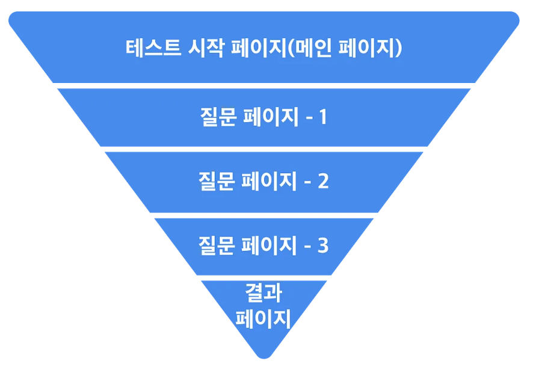
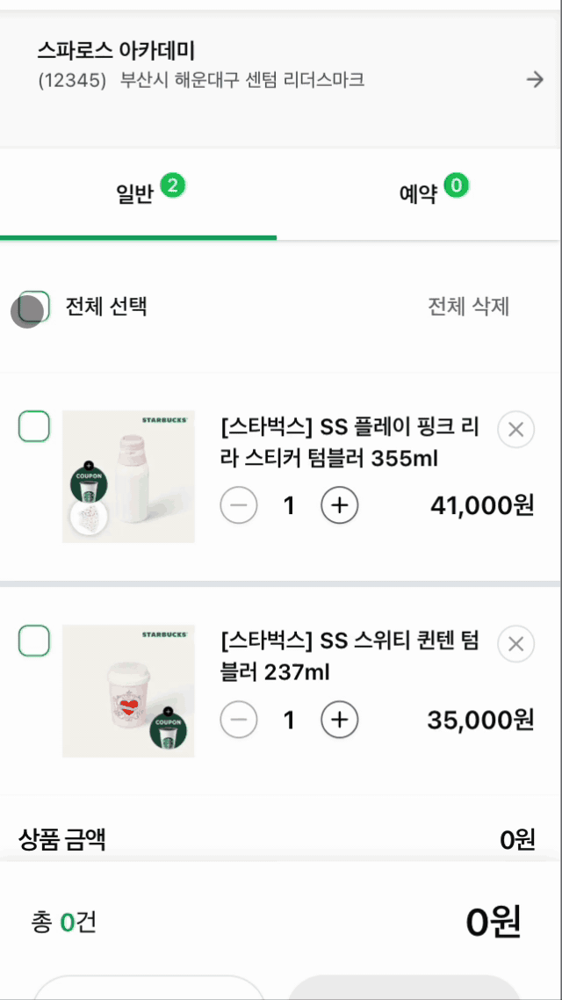
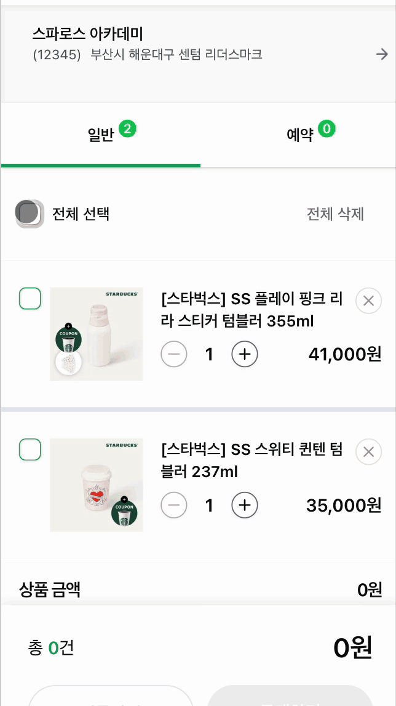
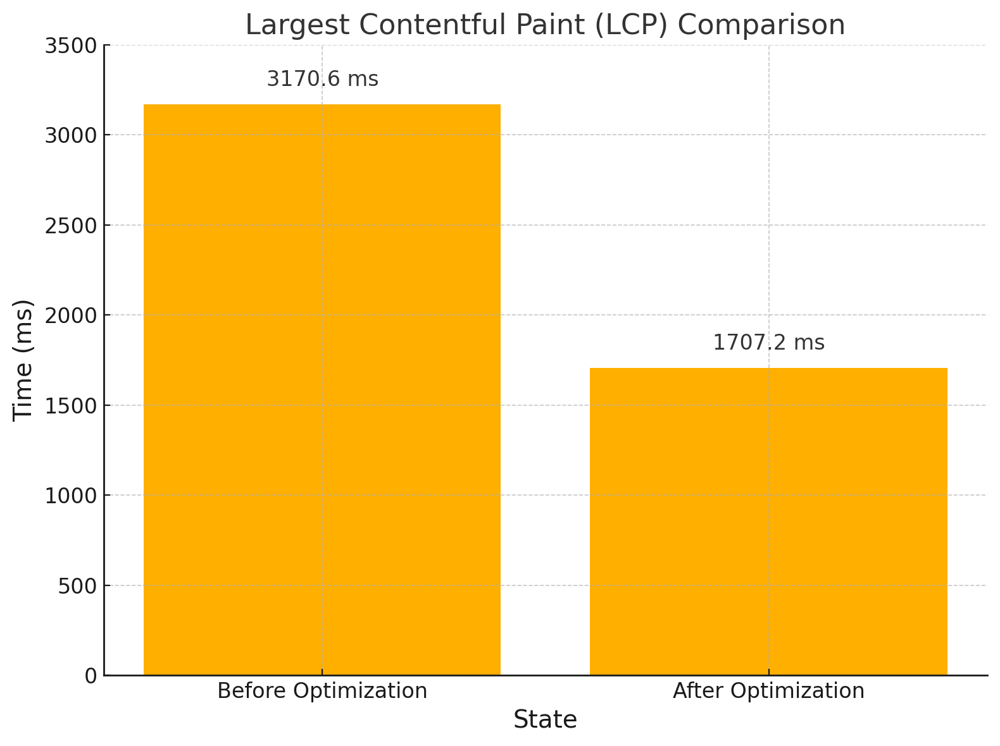

# Starbucks_renewal_project


## 목차

1. [기획](#1-기획-의도-및-기대-효과)
2. [개발 환경](#2-개발-환경)
3. [주요 기능](#3-주요-기능)
4. [기술 소개](#4-기술-소개)
5. [설계 문서](#5-설계-문서)
6. [팀원 소개](#6-팀원-소개)
7. [프로젝트 규칙](#7-프로젝트-규칙)
8. [포팅 메뉴얼](#8-포팅-메뉴얼)

## 1. 기획

> #### ✨ 신세계 I&C [스파로스 6기](https://swedu.spharosacademy.com/spharos_total.html) - 리빌딩 프로젝트
>
> #### ⏫ 스타벅스 내 Shopping 서비스를 새롭게 구현 및 성능 개선
>
> #### 📅 개발 기간 : 2025년 3월 10일 ~ 4월 28일
>
> #### 🌐 홈페이지 : https://www.starbucks-renewal.shop/

---

## 2. 개발 환경

### Frontend

| Name         | Version |
| ------------ | ------- |
| Next.js      | 15.2.4  |
| Typescript   | 5.0     |
| react        | 19.0.0  |
| tailwindcss  | 4.0.0   |
| zustand      | 5.0.3   |
| next-auth    | 4.24.11 |
| lucide-react | 0.484.0 |
| zod          | 3.24.2  |
| shadcn       | -       |

### Backend

| Name        | Version |
| ----------- | ------- |
| Java        | 17      |
| spring boot | 3.4.4   |
| -           | -       |
| -           | -       |
| -           | -       |
| -           | -       |

### Infra

| Name | Version |
| ---- | ------- |
| -    | -       |
| -    | -       |
| -    | -       |
| -    | -       |
| -    | -       |
| -    | -       |

### CI/CD

| Name | Version |
| ---- | ------- |
| -    | -       |
| -    | -       |

---

## 3. 주요 기능

---

## 4. 기술 소개

### 4-1. useFunnel Hook 활용

복잡한 단계별 회원가입 플로우를 효율적으로 관리하기 위해 커스텀 훅인 useFunnel을 도입



#### useFunnel 도입 이유

1.  단계별 상태 관리 : 다음 단계로 전달
2.  단계 전환 제어 : 사용자가 이전 단계로 돌아가거나 특정 단계로 이동
3.  UI 구성의 유연성 : 각 단계에 따라 다른 헤더나 콘텐츠를 렌더링

#### useFunnel 주요 기능

1. stepIndex를 통해 현재 단계의 인덱스를 관리
2. 폼 데이터 상태 관리: formData를 통해 각 단계에서 입력된 데이터를 유지
3. 입력 처리 함수 제공: onInput을 통해 사용자 입력을 처리하고 상태를 업데이트

#### 기대 효과

1. 유지보수 용이성 향상: 단계별 로직이 분리되어 있어 코드의 가독성과 유지보수성이 향상

2. 사용자 경험 개선: 사용자가 각 단계에서 필요한 정보를 명확하게 입력하고, 이전 단계로 쉽게 돌아갈 수 있어 사용자 경험이 향상

3. 확장성 확보: 새로운 단계의 추가나 기존 단계의 수정이 용이하여 플로우의 확장성이 확보

### 4-2. Optimistic UI 업데이트를 위한 useOptimistic Hook 활용

React 19 및 Next.js 15 기반으로 개발하였기에 새롭게 추가된 useOptimistic Hook을 활용하여 사용자 경험을 극대화.

- 기존 동작 방식
  
- hook 동작 방식
  

> useOptimistic
>
> - useOptimistic은 비동기 작업이 진행되는 동안, UI를 즉각적으로 업데이트할 수 있게 해 주는 React Hook
> - SSR 기반 환경에서도 사용자가 즉시 결과를 확인하여 사용자 경험 극대화(클릭 즉시 반영된 것 같은 경험)

### 4-3 Zustand 라이브러리를 활용한 상태 관리

Optimistic UI를 적용하면서, 클릭 시 바로 화면을 변화시키는 구조를 구현.

그러나, 하나의 버튼 클릭에 따라 화면 하단의 다른 컴포넌트까지 **동시에 상태를 변경**해야 하는 상황이 발생

Zustand를 도입하여 글로벌 상태 관리를 적용

> Zustand 라이브러리 선택 이유
>
> 1. Server/Client 경계에 구애받지 않는 단순한 API
> 2. 복잡한 Context Provider 구성 없이, 필요한 곳에서 바로 사용 가능
> 3. Next.js 15와 충돌 없이 동작

| 적용 전                       | 적용 후                      |
| ----------------------------- | ---------------------------- |
|  |  |

### 4-5 useDebouncedFetch Hook 활용

즉시 화면에 반영되도록 처리 하기 때문에 사용자가 짧은 시간 안에 여러 번 클릭하거나 입력을 변경하게 되면, **서버 액션이 연속적으로 호출** 과부하를 일으킬 수 있음.

그러나, 서버 응답을 기다리는 동안 버튼을 비활성화시키는 방식은 사용자 경험 저하 및 빠른 인터랙션의 흐름을 끊어버릴 위험 존재.

따라서, **클릭 시 UI는 즉각 반영하되, 서버 요청은 디바운스(Debounce) 방식으로 최적화** 하는 커스텀 훅 직접 구현

#### useDebouncedFetch 주요 특징

1. 로컬 상태(localState)는 즉시 업데이트하여 사용자에게 빠른 피드백 제공
2. 서버 요청은 마지막 입력 이후 일정 시간(delay) 동안 입력이 없을 때만 실행
3. 서버 요청 실패 시, 로컬 상태를 롤백하여 데이터 정합성 유지

### 4-6 react 리랜더링 최적화

초기 개발 단계에서는 최적화를 고려하지 않고 구현하여, 컴포넌트가 불필요하게 자주 리렌더링되는 문제 발생

이는, 퍼포먼스 저하로 이어짐

> useCallback과 memo 도입
>
> - useCallback: 콜백 함수를 메모이제이션하여 매 렌더링마다 새로운 함수 인스턴스가 생성되는 것을 방지.
> - React.memo: prop가 변경되지 않은 경우 컴포넌트 리렌더링을 방지하여 불필요한 렌더링 사이클을 대폭 줄임.

#### 개선 결과

| 지표                           | 최적화 전 (`localhost_2025-04-21_15-58-34.json`) | 최적화 후 (`localhost_3000-20250421T160009.json`) | 변화         |
| :----------------------------- | :----------------------------------------------- | :------------------------------------------------ | :----------- |
| First Contentful Paint (FCP)   | 0.9초 (909.6ms)                                  | 0.9초 (909.2ms)                                   | 거의 동일    |
| Largest Contentful Paint (LCP) | 3.2초 (3170.6ms)                                 | 1.7초 (1707.2ms)                                  | 대폭 개선 ✅ |
| Speed Index                    | 1.4초 (1408ms)                                   | 1.4초 (1363.9ms)                                  | 소폭 개선    |



**LCP가 3.2초 → 1.7초로 약 47% 개선**

---

## 5. 설계 문서

### 🏗시스템 아키텍쳐

<br>


<br>
<br>

### 📝ERD


### 📝 [ERD 링크](https://www.erdcloud.com/d/AfbenbEeNpbLj2dwu)

<br>
<br>

### 요구사항 정의서


<br>
<br>

### API명세서


---

## 6. 팀원 소개

|         |     |     |               |          |     |
| :-----: | :-: | :-: | :-----------: | :------: | :-: |
|         |     |     |               |          |     |
| Backend |     |     | Infra/Backend | Frontend |     |

**Backend**

**Frontend**

**Infra**

---

## 7. 프로젝트 규칙

### 1. 커밋 메시지 구조

커밋 메시지는 제목, 본문, 그리고 꼬리말로 구성됩니다.
[<스코프>]<타입>: <제목>

<본문>

<꼬리말>

#### _스코프(Scope)_

변경 사항의 범위를 나타냅니다. 예를 들어, 특정 모듈이나 기능의 이름을 사용할 수 있습니다.

- 예: auth, payment, ui, backend

#### _타입(Type)_

타입의 첫글자는 대문자로 작성합니다.

- _feat_: 새로운 기능 추가
- _fix_: 버그 수정
- _docs_: 문서 변경
- _style_: 코드 포맷팅, 세미콜론 누락 등 비즈니스 로직에 영향을 주지 않는 변경
- _remove_: 파일 삭제
- _refactor_: 코드 리팩토링, 기능 변경 없이 코드 개선
- _test_: 테스트 추가, 수정
- _chore_: 빌드 과정 또는 보조 도구 수정, 패키지 매니저 설정 등
- _perf_: 성능 향상 관련 변경
- _ci_: CI 구성 파일 및 스크립트 변경
- _wip_: 작업 진행 중 임시 저장

#### _제목(Subject)_

제목은 변경 사항을 간략하게 설명합니다. 첫 글자는 대문자로 작성하고, 명령문 형식으로 작성합니다.

- 50자를 넘지 않도록 하며, 마지막에 마침표를 찍지 않습니다.
- 예: [auth]feat: Add JWT authentication

#### _본문(Body)_

본문은 변경 사항의 이유와 주요 내용을 설명합니다. 필요 시 다음과 같은 규칙을 따릅니다:

- 한 줄에 72자를 넘지 않도록 합니다.
- "어떻게" 보다는 "무엇을", "왜" 변경했는지 설명합니다.
- 예:
  - Add JWT authentication to secure API endpoints
  - Update login method to issue JWT tokens
  - Modify user model to store JWT refresh tokens

---

### 2. Git 브랜치 작성 컨벤션

#### _브랜치 타입_

브랜치 타입을 명확히 구분하여 브랜치 이름을 작성합니다:

- _feature_: 새로운 기능 개발
- _bugfix_: 버그 수정
- _hotfix_: 긴급 수정
- _release_: 릴리스 준비
- _refactor_: 코드 리팩토링
- _test_: 테스트 관련 작업
- _chore_: 기타 잡무
- _wip_: 작업 진행 중 임시 저장

#### _브랜치 네이밍 규칙_

브랜치 이름은 <타입>/<설명> 형식을 따릅니다. 이슈 번호는 관련된 이슈 트래커의 번호를 사용하고, 설명은 변경 사항을 간략하게 나타냅니다.

- _feature_ 브랜치: 새로운 기능 추가
  - 예: feature/login-main
  - feature의 main branch는 -main을 작성합니다.
  - feature의 하위 branch는 다음과 같이 작성합니다. (feature/login/create)
- _bugfix_ 브랜치: 버그 수정
  - 예: bugfix/fix-login-error
- _hotfix_ 브랜치: 긴급 수정
  - 예: hotfix/critical-bug-fix
- _release_ 브랜치: 릴리스 준비
  - 예: release/1.0.0
- _refactor_ 브랜치: 코드 리팩토링
  - 예: refactor/optimize-auth-module
- _test_ 브랜치: 테스트 관련 작업
  - 예: test/add-unit-tests
- _chore_ 브랜치: 기타 잡무
  - 예: chore/update-dependencies

---

### 3. 브랜치 관리

- _main_: 항상 배포 가능한 상태를 유지합니다.
- _develop_: 다음 릴리스에 포함될 기능이 합쳐지는 브랜치입니다.

---

## 8. 포팅 메뉴얼

이 프로젝트는 [Next.js](https://nextjs.org) 프로젝트입니다.

### Getting Started

먼저, 개발 서버를 실행합니다:

```bash
npm run dev
# or
yarn dev
# or
pnpm dev
# or
bun dev
```

브라우저에서 [http://localhost:3000](http://localhost:3000) 을 열어 결과를 확인하세요.

페이지는 app/page.tsx 파일을 수정하여 편집을 시작할 수 있습니다. 파일을 수정하면 페이지가 자동으로 업데이트됩니다.

이 프로젝트는 [`next/font`](https://nextjs.org/docs/app/building-your-application/optimizing/fonts) 를 사용하여 [Geist](https://vercel.com/font)라는 새로운 글꼴을 자동으로 최적화하고 로드합니다.

## Learn More

Next.js에 대해 더 알아보려면 다음 리소스를 참고하세요:

- [Next.js Documentation](https://nextjs.org/docs) - Next.js 기능 및 API에 대해 배우기
- [Learn Next.js](https://nextjs.org/learn) - 대화형 Next.js 튜토리얼

[the Next.js GitHub repository](https://github.com/vercel/next.js)도 확인해보세요. 여러분의 피드백과 기여를 환영합니다!
